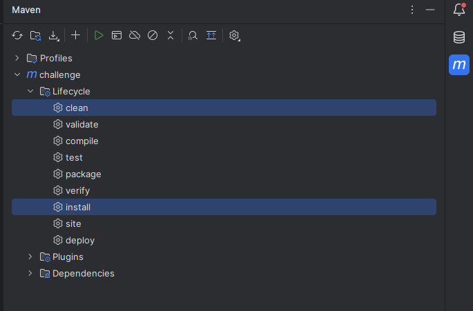
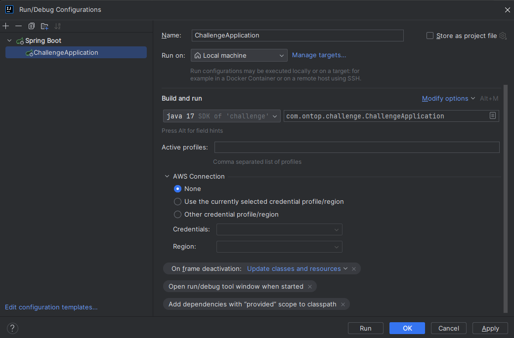

# Ontop's Challenge
## How to run
### Prerequisites
- Java 17
- Maven 3+

### Running project

If running through IntelliJ

 - run `mvn clean install` to generate sources from mapstruct 
    
 - Create Spring Boot configuration with the ChallengeApplication.java as the main class 
 
 - Running this configuration should start the app

If running directly through Maven

- run `mvn clean install` to generate sources from mapstruct
- Run the app with `mvn spring-boot:run`

